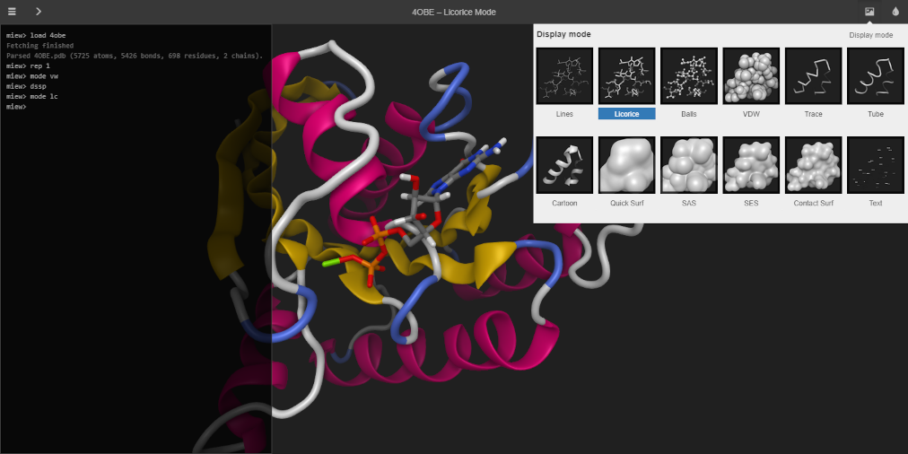

# Miew – 3D Molecular Viewer

[](https://github.com/epam/miew/actions?query=branch%3Amain)
[](https://ci.appveyor.com/project/paulsmirnov/miew)
[](https://www.npmjs.com/package/miew?activeTab=versions)
[](https://www.npmjs.com/package/miew?activeTab=versions)
[](./LICENSE.md)

Miew is a high performance web tool for advanced visualization and manipulation
of molecular structures. It provides a full-featured set of tools for 3D visualization and editing
of small molecules as well as large molecular complexes, including means to view, analyze,
and modify the 3D structure of a molecule.



It works as a standalone web application or integrates as a component into your web pages.
We plan to support the [latest versions](https://browsehappy.com/)
of WebGL-enabled desktop (Chrome, Firefox, Safari, Edge) and mobile (iOS, Android) browsers.

## Project Structure

- [miew] - the core JavaScript library including docs, examples, and the demo application,
- [miew-react] - a simple React.js wrapper component,
- [miew-app] - a new demo application (work in progress).

[miew]: packages/miew#readme
[miew-react]: packages/miew-react#readme
[miew-app]: packages/miew-app#readme

## Installation and Usage

The demo application is available at <https://miew.app> and <https://miew.opensource.epam.com>.

The library is published as an npm package. The easiest way to start using the viewer
is to reference a CDN version:

```html
<!doctype html>
<html lang="en">
  <head>
    <meta charset="UTF-8" />
    <script src="https://unpkg.com/lodash@^4.17.21/lodash.js"></script>
    <script src="https://unpkg.com/three@0.153.0/build/three.min.js"></script>
    <script src="https://unpkg.com/miew@0.11.0/dist/Miew.min.js"></script>
    <link rel="stylesheet" href="https://unpkg.com/miew@0.11.0/dist/Miew.min.css" />
  </head>
  <body>
    <div class="miew-container" style="width:640px; height:480px"></div>

    <script>
      (function () {
        var viewer = new Miew({ load: '1CRN' });
        if (viewer.init()) {
          viewer.run();
        }
      })();
    </script>
  </body>
</html>
```

For more details please refer to the corresponding README files ([miew] and [miew-react]).

## Contribution

Please read [CONTRIBUTING.md](CONTRIBUTING.md) for details on our code of conduct, and the process
for submitting pull requests.

## License

[MIT](LICENSE.md)

Copyright (c) 2015–2025 [EPAM Systems, Inc.](https://www.epam.com/)
