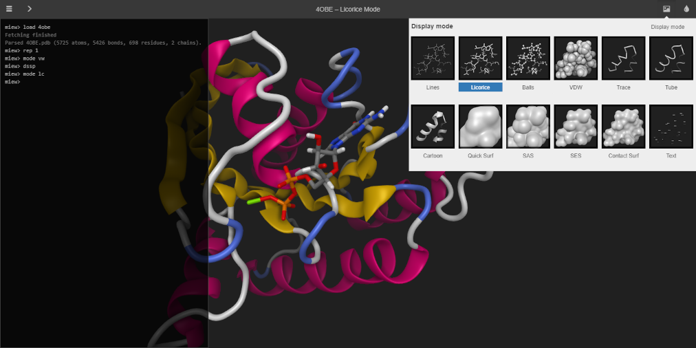

# miew-app

Miew is a high performance web tool for advanced visualization and manipulation
of molecular structures.

The `miew-app` package is an attempt to recreate a demo application using React.js.
Please refer to the topmost [README][] for an overview of the entire project.

[README]: https://github.com/epam/miew#readme

## Contribution

Please read [CONTRIBUTING.md](../../CONTRIBUTING.md) for details on our code of conduct, and the process for submitting pull requests.

## License

[MIT](../../LICENSE.md)

Copyright (c) 2015–2025 [EPAM Systems, Inc.](https://www.epam.com/)
