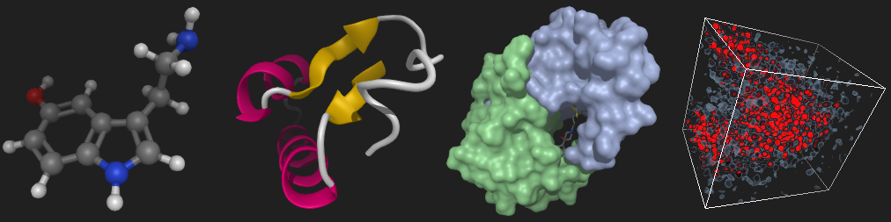

# miew-react

[](https://www.npmjs.com/package/miew-react?activeTab=versions)
[](https://www.npmjs.com/package/miew-react?activeTab=versions)
[](./LICENSE.md)

Miew is a high performance web tool for advanced visualization and manipulation
of molecular structures.

The `miew-react` package contains only a React.js wrapper component.
Please refer to the topmost [README][] for an overview of the entire project.

[README]: https://github.com/epam/miew#readme



## Installation and Usage

The component is available as an [npm package](https://www.npmjs.com/package/miew-react).

```sh
# npm create vite@latest .
npm i miew-react
```

src/main.jsx

```jsx
import { StrictMode } from 'react';
import { createRoot } from 'react-dom/client';
import Viewer from 'miew-react';

createRoot(document.getElementById('root')).render(
  <StrictMode>
    <Viewer options={{ load: '1crn' }} />
  </StrictMode>,
);
```

index.html

```html
<!doctype html>
<html lang="en">
  <head>
    <meta charset="UTF-8" />
  </head>
  <body>
    <div id="root" style="width:640px; height:480px"></div>
    <script type="module" src="src/main.jsx"></script>
  </body>
</html>
```

### Props

The component accepts the following optional props:

- **onInit**: a callback function which receives an instance of Miew, and called after initialization of Miew instance inside the Viewer component. With a help of this prop you can access Miew methods and fields.
- **onError**: a callback function which receives an Error object when Miew initialization fails. Use this prop to handle initialization errors gracefully.
- **options**: an object for passing custom settings to Miew. This can include everything from the initial molecule to load, to viewer settings and representations. All fields are optional. For a full list of available options, please refer to the Miew documentation.
- **theme**: ⚠️ **DEPRECATED** - This prop is deprecated and will be removed in future versions. It is kept for backwards compatibility only.

You can safely inline the options object and callback props (as in the example). The underlying Miew instance is recreated only when the actual option values change, so routine React re-renders will not trigger unnecessary re-initialization.

## Contribution

Please read [CONTRIBUTING.md](../../CONTRIBUTING.md) for details on our code of conduct, and the process for submitting pull requests.

## License

[MIT](LICENSE.md)

Copyright (c) 2015–2025 [EPAM Systems, Inc.](https://www.epam.com/)
