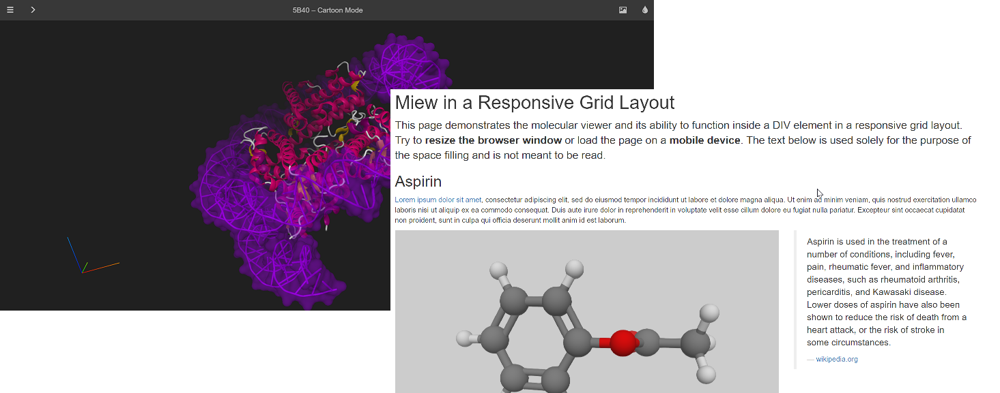

# miew

[](https://www.npmjs.com/package/miew?activeTab=versions)
[](https://www.npmjs.com/package/miew?activeTab=versions)
[](./LICENSE.md)

Miew is a high performance web tool for advanced visualization and manipulation
of molecular structures.

The `miew` package is the core JavaScript library that implements the functionality.
Please refer to the topmost [README][] for an overview of the entire project.

[README]: https://github.com/epam/miew#readme



## Installation and Usage

Miew library is available as an [npm package](https://www.npmjs.com/package/miew).
It provides both UMD and ES2015 modules, so can be included in a SCRIPT tag via a CDN
or built with a bundler of your choice. For more details refer to:

- [tutorials](docs/tutorials/),
- [examples](examples/).

### SCRIPT tag

```html
<!doctype html>
<html lang="en">
  <head>
    <meta charset="UTF-8" />
    <script src="https://unpkg.com/lodash@^4.17.21/lodash.js"></script>
    <script src="https://unpkg.com/three@0.153.0/build/three.min.js"></script>
    <script src="https://unpkg.com/miew@0.11.0/dist/Miew.min.js"></script>
    <link rel="stylesheet" href="https://unpkg.com/miew@0.11.0/dist/Miew.min.css" />
  </head>
  <body>
    <div class="miew-container" style="width:640px; height:480px"></div>

    <script>
      (function () {
        var viewer = new Miew({ load: '1CRN' });
        if (viewer.init()) {
          viewer.run();
        }
      })();
    </script>
  </body>
</html>
```

### Webpack

Install using npm:

```sh
# npm init
# npm i -D webpack webpack-cli style-loader css-loader
npm i miew
```

src/index.js

```js
import Miew from 'miew';
import './index.css';

window.onload = function () {
  var viewer = new Miew({ load: '1CRN' });
  if (viewer.init()) {
    viewer.run();
  }
};
```

src/index.css

```css
@import 'miew';
```

dist/index.html

```html
<!doctype html>
<html lang="en">
  <head>
    <meta charset="UTF-8" />
    <script src="main.js"></script>
  </head>
  <body>
    <div class="miew-container" style="width:640px; height:480px"></div>
  </body>
</html>
```

webpack.config.js

```js
module.exports = {
  module: {
    rules: [{
      test: /\.css$/,
      use: ['style-loader', 'css-loader'],
    }],
  },
};
```

## Contribution

Please read [CONTRIBUTING.md](../../CONTRIBUTING.md) for details on our code of conduct, and the process for submitting pull requests.

## License

[MIT](LICENSE.md)

Copyright (c) 2015–2025 [EPAM Systems, Inc.](https://www.epam.com/)
