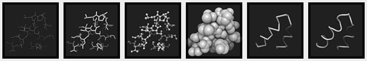
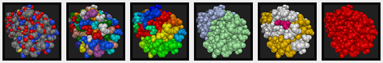
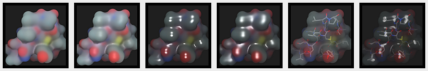

# Thumbnails

The demo application uses a set of thumbnails to denote available modes, colorings and materials.
If you decide to update the thumbnails, here are the instructions.

## Display Modes

 1. Use the following URL Query String to see 1CRN file from the fixed viewpoint. 

        ?l=1CRN&p=empty&r=0&m=CA&s=not+water&c=UN!color:16777215&mt=SF&v=1RItUwIGVn8D2KNy/pgq3Pe3rBr9ylu8/IBn2vw==&fogFarFactor=0.6&fogNearFactor=0&axes=false&fxaa=false&ao=true&debug.ssaoKernelRadius=0.9&debug.ssaoFactor=1

 2. Select the desired mode. Use high resolution and switch off Ambient Occlusion for surface modes.
 3. Open the terminal window and take a 512 &times; 512 screenshot.
 
        screenshot 512

 4. Resize the file to 96 &times; 96 pixels using Lanczos2 filter (sharper).
    Alternatively, apply Unsharp Mask filter.
    
 5. Save the file to `demo/images/mode/XX.png` using two-letter Mode ID as a file name.

## Colorings

 1. Use the following URL Query String to see 1AID file from the fixed viewpoint. 

        ?l=cif:1AID&r=0&m=VW&s=not+water&c=CF&v=18KeRwuF6IsJGtmPAs%2B8XPZrOGD9xy0I/ku/APQ==&fogFarFactor=0.4&fogNearFactor=0&axes=false&fxaa=false&ao=true

 2. Select the desired coloring.
 3. Open the terminal window and take a 512 &times; 512 screenshot.
 
        screenshot 512

 4. Resize the file to 96 &times; 96 pixels using Lanczos2 filter (sharper).
    Alternatively, apply Unsharp Mask filter.
    
 5. Save the file to `demo/images/colorer/XX.png` using two-letter Colorer ID as a file name.

## Materials

 1. Use the following URL Query String to see 1CRN file from the fixed viewpoint. 

        ?l=1CRN&p=empty&r=0&m=LC&s=not+water&c=EL&r=1&m=SE&s=not+water&c=EL&mt=SF&v=1RItUwIGVn8D2KNy/pgq3Pe3rBr9ylu8/IBn2vw==&fogFarFactor=0.6&fogNearFactor=0&resolution=high&axes=false&fxaa=false&ao=false&debug.ssaoKernelRadius=0.9&debug.ssaoFactor=1

 2. Select the desired coloring.
 3. Open the terminal window and take a 512 &times; 512 screenshot.
 
        screenshot 512

 4. Resize the file to 96 &times; 96 pixels using Lanczos2 filter (sharper).
    Alternatively, apply Unsharp Mask filter.
    
 5. Save the file to `demo/images/material/XX.png` using two-letter Material ID as a file name.

## Palettes

 1. Use the following URL Query String to see Glycine from the fixed viewpoint. 

        ?l=cif:1CRN&p=macro&s=sequence+22:34&r=1&s=sequence+2:3&v=1bjwPwW3%2BQsFuFMbA1kUQPpO4Wj8/v1K/zsjhPg%3D%3D&bg.color=0xCCCCCC&axes=false&fog=false

 2. Select the desired palette.
 3. Open the terminal window and take a 512 &times; 512 screenshot.
 
        screenshot 512

 4. Resize the file to 96 &times; 96 pixels using Lanczos2 filter (sharper).
    Alternatively, apply Unsharp Mask filter.
    
 5. Save the file to `demo/images/palette/XX.png` using two-letter Palette ID as a file name.
